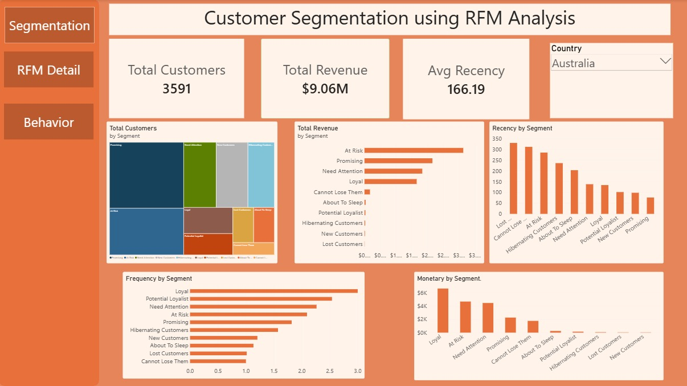
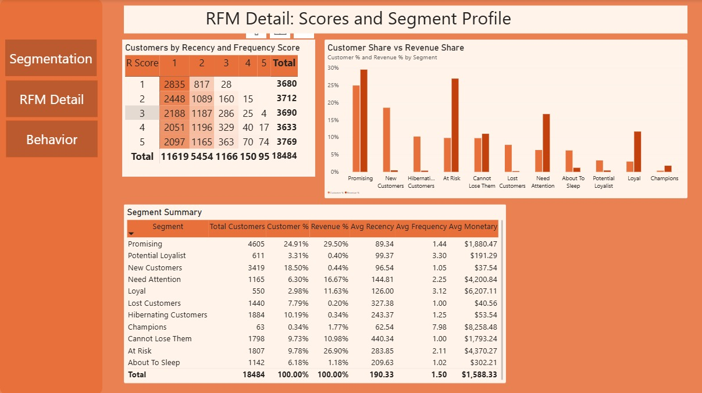
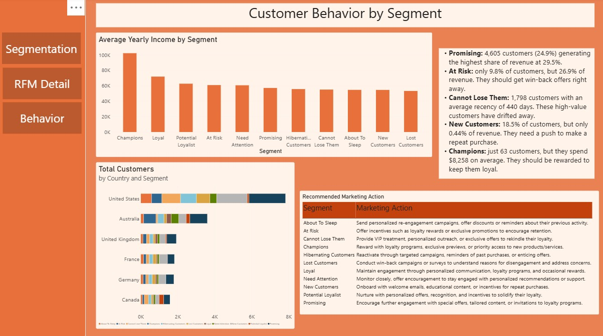

Customer Segmentation using RFM Analysis (Power BI)

A Power BI project that groups **18,484 customers** into **11 segments** using RFM analysis (Recency, Frequency, Monetary), studies how each segment behaves, and recommends a marketing action for each one.

Built as Project 1 of the Data Analysis Internship at **Syntecxhub**.

Business problem

Not every customer is worth the same effort. Businesses need to know who their best customers are, who is drifting away, and who is new, so that marketing money goes where it matters. RFM analysis answers this using three numbers per customer:

| Metric | Meaning |
|---|---|
| Recency | How many days ago the customer last bought |
| Frequency | How many separate orders the customer placed |
| Monetary | How much the customer spent in total |

Dashboard preview

Segmentation



RFM Detail



Behavior



Key findings

- **18,484 customers** and about **$29.36M** in sales (July 2005 to July 2008) were analysed.
- Five segments (Promising, At Risk, Need Attention, Loyal, Cannot Lose Them) produce about **95.7%** of revenue.
- **At Risk** customers are only 9.8% of the base but bring **26.9%** of revenue. They are the most important group to win back.
- **New Customers** are 18.5% of the base but only 0.44% of revenue. They need a push to make a second purchase.
- **62.9%** of customers bought only once, so Champions (0.34%) and Loyal (2.98%) are small groups. Growing repeat purchases is the main opportunity.

Segment summary

| Segment | Customers | Customers % | Revenue % | Avg Recency (days) | Avg Frequency | Avg Spend |
|---|---:|---:|---:|---:|---:|---:|
| Promising | 4,605 | 24.91% | 29.50% | 89.3 | 1.44 | $1,880 |
| At Risk | 1,807 | 9.78% | 26.90% | 283.9 | 2.11 | $4,370 |
| Need Attention | 1,165 | 6.30% | 16.67% | 144.8 | 2.25 | $4,201 |
| Loyal | 550 | 2.98% | 11.63% | 126.0 | 3.12 | $6,207 |
| Cannot Lose Them | 1,798 | 9.73% | 10.98% | 440.3 | 1.00 | $1,793 |
| Champions | 63 | 0.34% | 1.77% | 62.5 | 7.98 | $8,258 |
| About To Sleep | 1,142 | 6.18% | 1.18% | 209.6 | 1.02 | $302 |
| New Customers | 3,419 | 18.50% | 0.44% | 96.5 | 1.05 | $38 |
| Potential Loyalist | 611 | 3.31% | 0.40% | 99.4 | 3.30 | $191 |
| Hibernating Customers | 1,884 | 10.19% | 0.34% | 243.4 | 1.25 | $54 |
| Lost Customers | 1,440 | 7.79% | 0.20% | 327.4 | 1.00 | $41 |

Dataset

AdventureWorksDW (Microsoft's public sample data warehouse). Three tables were used:

| Table | Rows | Used for |
|---|---:|---|
| FactInternetSales | 60,398 | Orders: CustomerKey, SalesOrderNumber, OrderDate, SalesAmount |
| DimCustomer | 18,484 | Gender, yearly income, occupation, education |
| DimGeography | 655 | Country and city |

The dataset is not included in this repository because the `.pbix` file already contains the data. You can download the sample from Microsoft: [AdventureWorks sample databases](https://learn.microsoft.com/en-us/sql/samples/adventureworks-install-configure).

A small lookup table, `data/RFM_Segment_Lookup_Clean.xlsx`, maps each 3-digit RFM score to a segment name and a marketing action.

## Tools

- Power BI Desktop (Power Query for cleaning, DAX for calculations)
- Excel (source files and the segment lookup table)

## Approach

1. Data cleaning (Power Query). Column profiling on the full data set: 0% errors and 0% empty values, no duplicate order lines, no zero or negative sales. Kept only the needed columns and set correct data types.
2. RFM metrics.** Reference date is **1 August 2008** (last order date plus one day), not today's date, because the data ends in 2008.
3. Scoring (1 to 5).Recency and Monetary use the 20th/40th/60th/80th percentiles. Frequency uses a direct rule (1 order = 1, up to 5 or more orders = 5) because most customers ordered only once.
4. Segmentation. The three scores are joined into one number (for example 435) and matched to a segment using the lookup table.
5. Behavior analysis. Segments compared by yearly income and country.
6. Recommendations. One marketing action per segment (see the report).
7. Dashboard.Three pages with page navigation buttons and a country filter.

 Lookup table fixes

- Segment names differed in case between the two sheets ("Lost customers" vs "Lost Customers"). They were standardised.
- Scores 231, 241 and 251 appeared under two segments. They were kept under "About To Sleep".

Key DAX

dax
RFM =
VAR RefDate = MAX ( FactInternetSales[OrderDate] ) + 1
RETURN
ADDCOLUMNS (
    VALUES ( FactInternetSales[CustomerKey] ),
    "Recency",   DATEDIFF ( CALCULATE ( MAX ( FactInternetSales[OrderDate] ) ), RefDate, DAY ),
    "Frequency", CALCULATE ( DISTINCTCOUNT ( FactInternetSales[SalesOrderNumber] ) ),
    "Monetary",  CALCULATE ( SUM ( FactInternetSales[SalesAmount] ) )
)


dax
F Score = MIN ( RFM[Frequency], 5 )

RFM Score = RFM[R Score] * 100 + RFM[F Score] * 10 + RFM[M Score]

Segment = RELATED ( Segment_Lookup[Segment] )
```

Marketing recommendations 

| Segment | Action |
|---|---|
| Champions | Reward with loyalty perks, early access and referral incentives |
| Loyal | Upsell premium products and run a loyalty programme |
| Potential Loyalist | Cross-sell and bundle offers to raise basket size |
| Promising | Follow-up offers and recommendations to drive repeat purchases |
| New Customers | Welcome emails and a small incentive for a second purchase |
| Need Attention | Personalised reminders and limited-time offers |
| About To Sleep | Reactivation reminders and discounts |
| At Risk | Top priority win-back campaign with personalised offers |
| Cannot Lose Them | VIP treatment and personal outreach |
| Hibernating Customers | Low-cost email reactivation only |
| Lost Customers | Low-cost survey to learn why they left |

 How to open

1. Download "RFM_Customer_Segmentation.pbix".
2. Open it in [Power BI Desktop](https://powerbi.microsoft.com/desktop/) (free, Windows).
3. Use the buttons on the left to move between the three pages, and the Country filter on the Segmentation page.

The full write-up is in [RFM_Project_Report.pdf]("RFM_Project_Report.pdf").

Limitations

- 62.9% of customers have only one order, so Frequency scores are mostly 1 or 2 and the top segments are small.
- The data is from 2005 to 2008, so the findings show the method rather than the current market.
- Percentile bands can split tied values, so results may differ slightly between tools.
- Amounts are in US dollars.

Author

Rani Rai
Data Analysis Intern, Syntecxhub
LinkedIn: https://www.linkedin.com/in/rani-rai-8223363a7/
